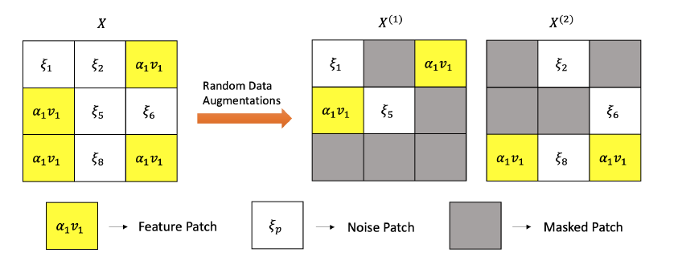
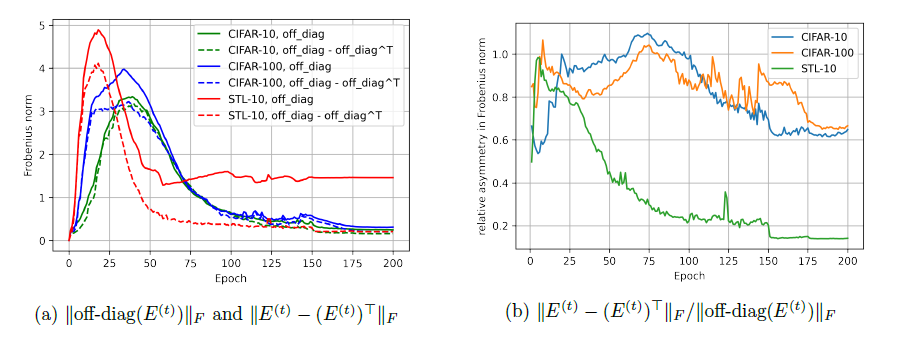

# The Mechanism of Prediction Head in Non-contrastive Self-supervised Learning

intuition: due to the existence of trivial dimensional collapsed global optimal solutions (even with prediction head), the analysis depends on the properties of the minimal of loss function is not proper.

-----------------------------
### Data Setting 

#### original data
对于每个sample X, 将其分为p个patches,每个patches为d*1 维,并且将这些patches分为with strong features ,weak feature, 以及noise
$$
X_{p}=z_{p}(X)v_{\ell}+\xi_{p}{\bf I}_{z_{p}=0},\quad{\bf E}_{X\sim D}[z_{p}(X)]=0,\quad\forall p\in\{P\} 
$$
We denote $S(X)\,=\,\{p\,\colon z_{p}(X)\,\neq\,0\}\,\subseteq\,[P]$ as the set of feature patches and assume $\varepsilon_{p}(X)\,=$  $z_{p^{\prime}}(X)\,\in\,\left\{0,\pm\alpha_{\ell}\right\},\forall p,p^{\prime}\,\in\,[P]$

$\alpha_1 = 2^\mathrm{polyloglog(d)}, \alpha_{2}\,=\,\alpha_{1}/\mathrm{polylog}(d).$ 

#### augmented data

$$
X^{(1)}=(X_{p}{\bf I}_{p\in{\cal P}})_{p\in[P]},\quad X^{(2)}=(X_{p}{\bf I}_{p\notin{\cal P}})_{p\in[P]} 
$$

*这里有个问题就是如何去看待经过random mask之后的分布，这个也值得去看一下，因为在之前的论文里面，如果假设了original data以及augmented data是一个分布的话，那么optimal solution就是Identity*

### Loss function and model setting

$$
\begin{array}{l}{{L_{S}(W,E):=\displaystyle\frac{1}{N}\sum_{i\in[N]}\left\Vert\widetilde{F}(X^{(i,1)})-S\mathrm{topGrad}[\widetilde{G}(X^{(i,2)}])\right\Vert_{2}^{2}}}\\ {{\ =2-\displaystyle\frac{1}{N}\sum_{i\in[N]}\langle\widetilde{F}(X^{(i,1)}),S\mathrm{topGrad}[\widetilde{G}(X^{(i,2)})]\rangle}}\end{array} 
$$
其中，前面的$i$是batch，第二个数字表示哪一个branch, 文章中假设$W = (\omega_1 ,\omega_2) \in \mathbb{R}^{d\times 2}$，并且
$$
\tilde{F}_{j}(X):=\mathrm{BN}(F_{j}(X))=\mathrm{BN}\left[\sum_{p\in [P]}\left(\sigma(\langle w_{j},X_{p}\rangle)+\sum_{r\neq j}E_{j,r}\sigma(\langle w_{r},X_{p}\rangle)\right)\right] 
$$

$$
\tilde{G}_{j}(X):=\mathrm{BN}\,(G_{j}(X))=\mathrm{BN}\biggl[\sum_{p\in|P|}\sigma(\langle w_{j},X_{p}\rangle)\biggr] 
$$

Given a batch of inputs $\{z_{i}\}_{i\in\mathbb{N}}$ 
$$
{\bf B N}(z_{i}):=\frac{z_{i}-\frac{1}{N}\sum_{i\in[N]}z_{i}}{\sqrt{\frac{1}{N}\sum_{i\in[N]}z_{i}^{2}-\left(\frac{1}{N}\sum_{i\in[N]}z_{i}\right)^{2}}} 
$$

使用矩阵的形式，$X^{(1)}$是m*d, W是d\*2, E是2\*2,并且是$E_{21}$对应$\omega_1$
$$F(X) = \sigma (X^{(1)T}W)E$$

其中 $E$ 是prediction head, 并且是假设diagonal 都是1，并且是不可以学习的，off-diagonal是可以学习的
$$E = 
\left[
\begin{matrix}
1 &E_{12} \\
E_{21} & 1 \\
\end{matrix}
\right]
$$
$$
\tilde{F}_{2}(X^{(1)}) =\left(f_{2}(X^{(1)})+E_{2,1}^{(t)}f_{1}(X^{(1)})\right)
$$
  

**训练算法是SGD**，这个很重要，因为正是SGD,而不是Adam，所以strong feature与weak feature之间就有梯度大小的差异，这也是很多理论分析所采用的算法。学习率中 prediction head 所用的$\eta_E$ 会比 encoder所用的$\eta^2$更小。

----------------
### learning phase
首先需要明确，所有的learning dynamics分析都是基于学到的feature是线性的，所以作者在证明的时候就是考虑如何去更新内积，比如
$$
\langle \omega_j ,v_2\rangle \leftarrow \langle \omega_j ,v_2\rangle+\lambda \langle-\nabla_{w_{j}}L(W^{(t)},E^{(t)}),v_{2}\rangle 
$$
~~并且noise与feature都会相互独立，且足够小，那么内积的量级就会很小，所以每个阶段都会将其忽略不计~~
这个地方也错了 在前两个阶段，很多的$\omega$都会在噪声上面

**作者将$d$ 当作是一个变量来分析，所有的大小分析都是与d有关的，~~那其实意思就是d需要足够的大,这是错误的~~**

*证明中有分析，但是证明过于繁琐，仅简单说明一下逻辑*
#### phase I
larger magnitude enjoys larger gradients, 所以会先学习到$v_1$，或者说$v_1$学习的更快，并且作者假设了其中neurons $f_1$会学习的更快，或者说是在学习$\langle \omega_j ,v_1\rangle$中，$f_1$拥有更大的**信噪比**（信噪比类似一个mean/variance的大小，越大的越稳定，在[[Adam]]算法中也有提及。

lemma5.1表示，在$T_1 = O(d^{2+o(1)}/\eta)$时间后：
 $\langle w_{1}^{(T_{1})},v_{1}\rangle\Omega(1)$ , while all other features $\langle w_{j}^{(T_{1})},v_{\ell}\rangle=o(1)$,for $(j,\ell)\neq(1,1)$ are small. And the prediction head $\|E^{(T_{1})}-I_{2}\|_{2}\leq$  $d^{-\Omega(1)}$ is still close to the initialization.

 大概的解释可以是刚开始是学习strong feature的，是没有问题的，此时也是大量的$\omega$并没有学到特征，都在$V = span\{v_1,v_2\}$**的补**上面了。  
 ~~但是为什么这里不需要$O$的操作呢，作者写错了。~~

  ***在实验的图里面并没有观察到这样的现象*** 这个一会儿还得看一下，也就是我们需要关注一下这个时间！

#### phase II
for *much shorter time* than learning $\langle w_{1}^{(t)},v_{1}\rangle$ we shall have $E_{2,1}^{(t)}$ increasing until $|E_{2,1}^{(t)}f_{1}(X^{(1)})|\gg|f_{2}(X^{(1)})|$ when X is equipped with feature $\ v_{\mathrm{1}}$. In other words $E_{2,1}^{(t)}f_{1}(X^{(1)})$ is a substitute for the feature $\ v_{\mathrm{1}}$ that should be learned by~~应该不是$\ f_{2}.$~~ 是$F_2$? 

证明里面也是说明encoder学习到的内积不是很大（除了$\omega_1 v_1$），并且
$$
\vert E_{2,1}^{(T_{2})}\vert=\Theta(\sqrt{\eta_{E}/\eta}) 
$$
这个阶段是虽然本身的模很小，但是$|E_{2,1}^{(t)}f_{1}(X^{(1)})|$是足够大的，附录里面把学习$E_{2,1}^{(T_{2})}$的过程称为***substitution*** 

大致的证明思想还是，仍然是大量的$\omega$在噪声处，也就是和投影到噪声上面的分量会更大，所以会有high signal-to-noise ratio of learning $\omega_2^{(t)} >E^{(t)}_{2,1}$
$$
\begin{array}{l}{{\tilde{F}_{2}(X^{(1)})\cdot\tilde{G}_{2}(X^{(2)})\propto\left(f_{2}(X^{(1)})+E_{2,1}^{(t)}f_{1}(X^{(1)})\right)\times f_{2}(X^{(2)})}}\\ {{\approx\sum_{\ell\in[2]}\alpha_{\ell}^{6}\left(\langle w_{2}^{(t)},v_{\ell}\rangle^{6}+E_{2,1}^{(t)}\cdot\langle w_{1}^{(t)},v_{\ell}\rangle^{3}\cdot\langle w_{2}^{(t)},v_{\ell}\rangle^{3}\right)}}\end{array} 
$$
-----------
***所以总结来说，前两个阶段是因为噪声的影响，也正是刚开始学习的过程***

---------------
#### phase III
总体而言就是在学习$v_2$的过程，这个过程会涉及到**prediction head, stop gradient, BN** 三者的相互配合。

After $E_{2,1}^{(t)}$ is learned in Lemma $w_{2}^{(t)}$ wrill ***be much faster than*** $v_{1},$ until $||w_{2}^{(t)}-\beta_{2}v_{2}|| \leq o(1).$ for some $\beta_{2}=\Theta(1)$ 

*其他内积就没怎么变*。

##### Stop Gradient

 $-\nabla_{w_{2}}F_{2}(X^{(1)}) \cdot$ StopGrad $\left[G_{2}(X^{(2)})\right]$，如果stopgrad在G上面时候，是在最大化$f_2 (X^{(1)}) \cdot f_2(X^{(2)})$,而不是$F_2 (X^{(1)}) \cdot f_2(X^{(2)})$(这是SG在F一侧时候会出现的)，因为上面的式子里面，对$\omega_2$求偏导，只有$f_2$，所以是$f_2\cdot f_2$.

 而让$f_2 (X^{(1)}) \cdot f_2(X^{(2)})$更大的话，就会使得所要学习的$\omega_2$里面不包含特别多的$v_1$的信息，也就是梯度里面没有什么$v_1$，就可以更有可能好学习到$v_2$。这里因为$E_{2,1}^{(t)}f_{1}(X^{(1)})$里面都是$v_1$的信息。

##### Batch Normalization

$$
\nabla_{W}{\cal L}(W,E)=\nabla_{W}\sum_{j\in\{2\}}\frac{\mathbb{E}[F_{j}(X^{(1)})\cdot{\mathrm{StopGrad}}[G_{j}(X^{(2)})]]}{\sqrt{\mathbb{E}[F_{j}^{2}(X^{(1)})]}\sqrt{\mathbb{E}[{\mathrm{StopGrad}}[G_{j}^{2}(X^{(2)})]]}} 
$$

 $\nabla_{w_{2}}\tilde{F}_{2}(X^{(1)}) \cdot$ StopGrad $\left[\tilde{G}_{2}(X^{(2)})\right]= \nabla_{w_{2}} \frac{f_2(X^{(1)})}{\sqrt{(Var[F_2(X(1))])}} \propto$ $\sum_{\ell\in\lbrack2]}\left([E_{2,1}^{(t)}(w_{1}^{(t)},v_{3-\ell})^{3}]^{2}+Var[f_{2}(X^{(1)})]\right)\langle\nabla_{w_{2}}f_{2}(X^{(1)}),v_{\ell}\rangle v_{\ell}$
 
 当$\ell =2$时候，会借$[E_{2,1}^{(t)}(w_{1}^{(t)},v_{1})^{3}]$的信息去把梯度提高，所以会加速在$\omega_2$上$v_2$的学习。并且明显会超过$v_1$.

 并且，如果去掉了BN,就不会有$v_1$去调整梯度学习$\langle w_2,v_2 \rangle$了。

 ##### Prediction Head
 如果没有prediction head，就算是有BN，全部的encoder都只会学习到$v_1$,不管有神经元有多少，并且这个解也是global optimal的。这就是dimensional collapse. 因为是BN 所以不会出现totally collapsed.
 $$
w_{j}^{(T)}=\beta_{j}v_{1}+\varepsilon_{j}\qquad w i t h\quad|\beta_{j}|=\Theta(1),~||\varepsilon_{j}||_{2}\le\widetilde O({\frac{1}{\sqrt{d}}}) 
$$

 #### Phase IV
 After some $t\geq T=poly(d)/\eta$ , $\|E^{(t)}-I_{2}\|_{F}\le\frac{1}{\mathrm{poly}(d)}$ 

 在多项式时间内，当encoder把全部的feature全部学到了，并且也de-noising了，$E$就会变成一个identity。 matrix.

---------
### 实验
实验中使用的就是***Adam***算法，有点奇怪。这跟SGD中梯度的大小就不符合了。

$E:64*64$，$\eta:0.003$

图中表示的是最后predictor 是否为identity，文章表示虽然不一定都converge to identity,但是都会有上升和下降的一个曲线。

----------------
### 问题
1. 结论中 phase I 经历的时间是最长的，但是这个阶段E没有学习，怎么没有体现出来？
2. converges to identity 在NeurIPS-2022-bridging-the-gap-from-asymmetry-tricks-to-decorrelation-principles-in-non-contrastive-self-supervised-learning-Paper-Conference中也有，因为都没有利用条件期望,也就是假设了x和augmented x是同分布的,所以是identity，但是在下面这个setting中就不是identity。其中$x$表示augmented $\bar x$表示original data
$$
\begin{array}{l}{{{\mathcal{L}}(W)=\mathbb{E}_{x,x^+}{\cfrac{1}{2}}\|W z_{x}-{\mathrm{sg}}(z_{x^+})\|^{2}}}\\ {{={\cfrac{1}{2}}\left[\mathrm{Tr}\left(W^{\mathsf{T}}W\mathbb{E}_{x}z_{x}z_{x}^{\mathsf{T}}\right)-2\mathrm{Tr}\left(W\mathbb{E}_{x,x^+}{\mathfrak{}}z_{x}z_{x}^{\mathsf{T}}\right)+\mathrm{Tr}\left(\mathbb{E}_{x^{+}}{z}_{x+}{z}_{x^+}^{\mathsf{T}}\right)\right]}}\end{array} 
$$
$$
\begin{array}{l}{{\mathbf{E}_{x,x^{+}}z_{x^{+}}^{\top}=\mathbb{E}_{\bar{x}}\mathbb{E}_{x,x^{+}|\bar{x}}z_{x}z_{x^{+}}^{\top}}}\\ {{\ =\mathbb{E}_{\bar{x}}\left(\mathbb{E}_{x|\bar{x}}z_{x}\right)\left(\mathbb{E}_{x|\bar{x}^{+}}z_{x}^{\top}\right)^{\top}}}\\ {{\ =\mathbb{E}_{\bar{x}}z_{\bar{x}}z_{\bar x}^{\top}}}\\ {{\ =\mathbb{C}_{\bar{z}}}}\end{array} 
$$
$$
\mathbb{C}_{z}= \mathbb{E}_xz_xz_x^T
$$
$$
\frac{\partial{\mathcal{L}}(W)}{\partial W}=W C_{z}-{\bar{C}} 
$$
